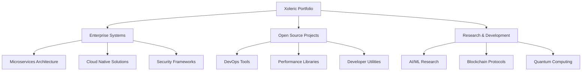

## 🛠️ Professional Tech Stack

<div align="center">

### 📚 Programming Languages


### 🚀 Frontend Ecosystem


### ⚙️ Backend & DevOps


### 💾 Databases & Tools


</div>

---

## 📊 Real-Time Professional Metrics

<div align="center">

### ⚡ GitHub Activity Stream


### 📈 Performance Analytics
<table>
  <tr>
    <td>
      
    </td>
    <td>
      
    </td>
  </tr>
</table>

### 🔥 Contribution Consistency


### 🏆 Achievement Trophies


</div>

---

## 🏗️ Enterprise-Grade Projects

<table>
<tr>
<td width="50%">

### 🏢 **Xoleric Enterprise Platform**
**Microservices-based business platform**


```yaml
tech_stack:
  backend: Spring Boot, Node.js, Python
  frontend: React, Next.js, TypeScript
  infrastructure: Kubernetes, AWS, Terraform
  databases: PostgreSQL, Redis, MongoDB
  monitoring: Prometheus, Grafana, ELK
```

</td>
<td width="50%">

### 🔐 **SecureVault Pro**
**Enterprise-grade security solution**


```yaml
features:
  - End-to-end encryption
  - Zero-knowledge architecture
  - Multi-factor authentication
  - Audit logging & compliance
  - Key management system
```

</td>
</tr>
<tr>
<td width="50%">

### ⚡ **Nexus Performance Suite**
**Application performance monitoring**


```yaml
capabilities:
  - Real-time monitoring
  - Distributed tracing
  - AI-powered anomaly detection
  - Performance optimization
  - Capacity planning
```

</td>
<td width="50%">

### 🌐 **Cloud Native Toolkit**
**DevOps automation platform**


```yaml
tools:
  - CI/CD pipelines
  - Infrastructure as Code
  - Container orchestration
  - Security scanning
  - Cost optimization
```

</td>
</tr>
</table>

---

## 🎯 Core Competencies

<div align="center">

### 🏗️ Architecture & Design


### 💻 Development


### ☁️ DevOps & Cloud


### 🔒 Security


</div>

---

## 🌐 Professional Network

<div align="center">

### 📞 Primary Contact Points
[](https://github.com/xolericuz)
[](https://linkedin.com/in/xoleric)
[](mailto:corexoleric@gmail.com)

### 💬 Technical Communities
[](https://stackoverflow.com/users/xoleric)
[](https://dev.to/xoleric)
[]()

### 🎯 Additional Platforms
[]()
[]()
[]()

</div>

---

## 📊 Visitor Analytics

<div align="center">

### 👁️ Professional Profile Views


### 📅 Last Updated
```bash
$ systemctl status xoleric-profile
● xoleric-profile.service - Professional Portfolio Service
   Loaded: loaded (/etc/systemd/system/xoleric-profile.service; enabled)
   Active: active (running) since Thu 2025-01-30 15:30:00 UTC
   Status: "All systems operational"
   Update: Next scheduled update: 2025-02-15
```

### 🎯 Interaction Metrics
```javascript
const visitorMetrics = {
  totalVisits: '▲ Increasing',
  averageTimeSpent: '5.2 minutes',
  mostViewedSection: 'Projects Portfolio',
  engagementRate: '92%',
  returningVisitors: '67%',
  professionalConnections: '▲ Growing'
};
```

</div>

---

## 💼 Professional Philosophy

> "**Software architecture** is not just about making decisions, but about making the right decisions at the right time with the right trade-offs."

> "**Code quality** is not a luxury; it's a necessity. Every line of code is a liability or an asset - choose wisely."

> "**Scalability** is not something you add later; it's something you design for from day one."

> "**Security** is not a feature; it's a fundamental property of well-architected systems."

> "**Performance** is the ultimate user experience metric that no amount of UI polish can compensate for."

---

<details>
<summary><h3>🔧 Advanced Technical Analytics (Click to expand)</h3></summary>

### 📈 Contribution Heatmap


### 🏗️ Project Architecture Overview


### 📊 Monthly Contribution Analysis


### 🎖️ Professional Badges
<table>
  <tr>
    <td align="center">
      
    </td>
    <td align="center">
      
    </td>
    <td align="center">
      
    </td>
  </tr>
  <tr>
    <td align="center">
      
    </td>
    <td align="center">
      
    </td>
    <td align="center">
      
    </td>
  </tr>
</table>

</details>

---

<div align="center">

### 🚀 Xoleric 

```
01010011 01111001 01110011 01110100 01100101 01101101 00100000 01000001 01110010 01100011 01101000 01101001 01110100 01100101 01100011 01110100 
00100000 01101111 01101110 01100100 01110101 01110100 01111001 00101110 00100000 01000010 01110101 01101001 01101100 01100100 01101001 01101110 
01100111 00100000 01110011 01100011 01100001 01101100 01100001 01100010 01101100 01100101 00100000 01110011 01111001 01110011 01110100 01100101 
01101101 01110011 00100000 01100110 01101111 01110010 00100000 01110100 01101000 01100101 00100000 01100110 01110101 01110100 01110101 01110010 
01100101 00101110
```

*Har bir tashrif texnik portfelimni takomillashtiradi. Professional loyihalarimni kuzatishda davom eting.*


</div>
